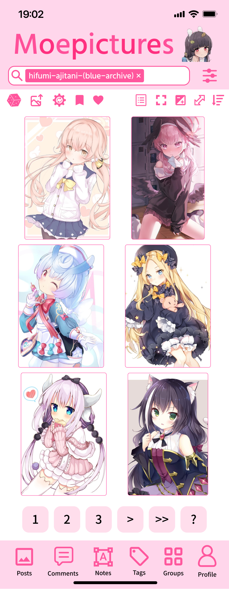

# Moepictures App

    
    

The mobile app for Moepictures! Supported on iOS, Android, iPad, and Android Tablet.

### Design

Our design is available here: https://www.figma.com/design/iB9H1DBk2qVhloD4nD1RGF/Moepictures-App

### Installation

It will be released on mobile app stores at some point, but for now you can download the beta version for 
android from [releases](https://github.com/Moebytes/Moepictures-App/releases). 

You can't install apps outside of the store on iOS. 

### Website

- [Moepictures](https://github.com/Moebytes/Moepictures)
