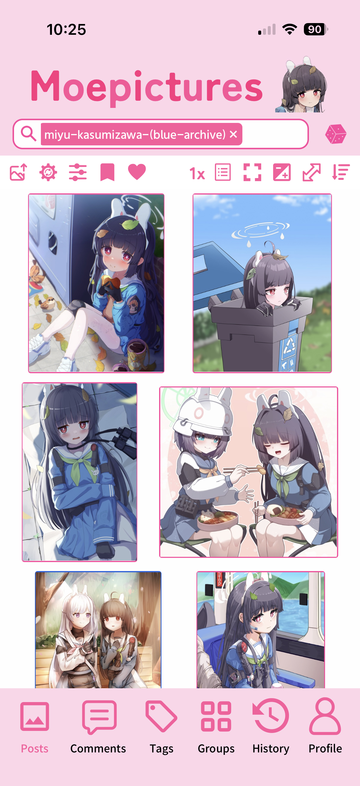
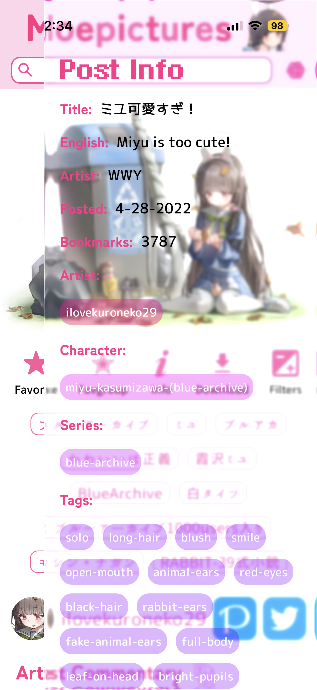

# Moepictures App

    
    

The mobile app for Moepictures! Supported on iOS, Android, iPad, and Android Tablet. 

### Features

We aim for feature-parity with our website, however it's known that these features are not available:

- Notes
- Non-image posts
- Messages
- Uploading
- Enable 2FA
- Moderator log
- Some post actions
- Edit image source
- Falling particles
  
### Design

Our design is available here: https://www.figma.com/design/iB9H1DBk2qVhloD4nD1RGF/Moepictures-App

### Download

&nbsp;&nbsp;

  

### Website

- [Moepictures](https://github.com/Moebytes/Moepictures)
